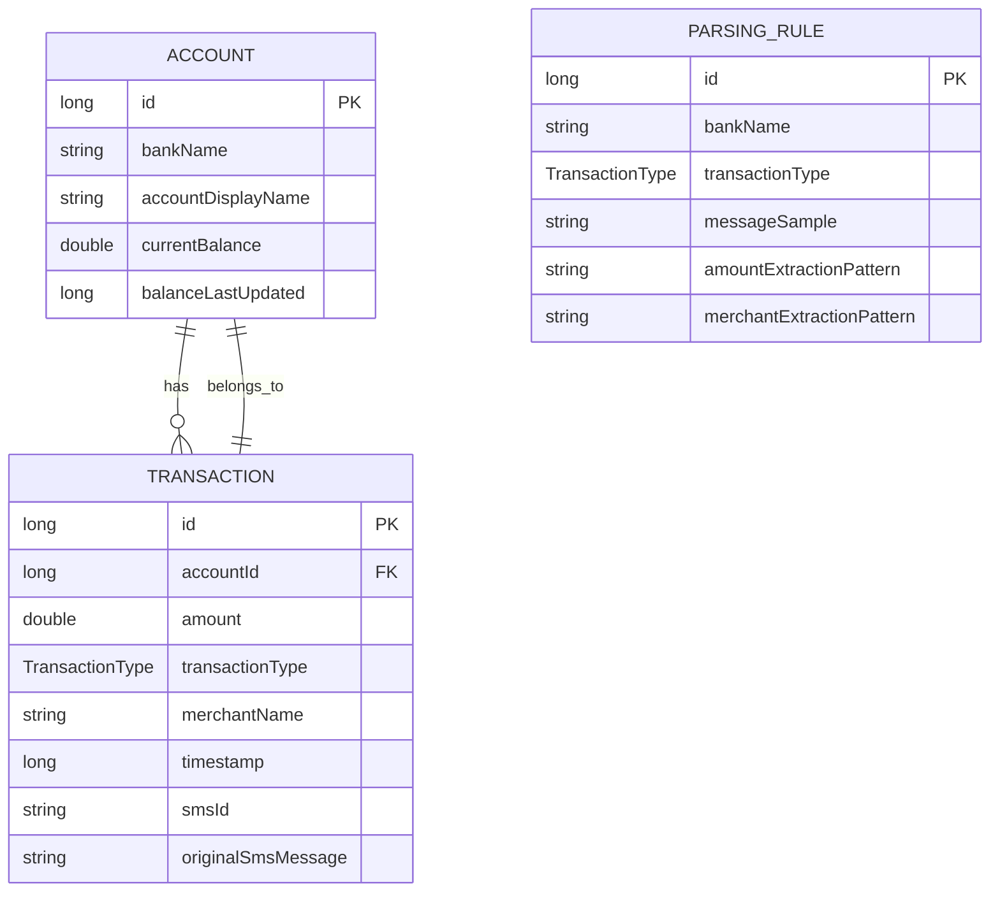

# Automatic Expenses Calculator: Project Foundation and Room Schema Design

## 1. Overview

The Automatic Expenses Calculator is an Android application designed to automatically parse SMS messages from banks and financial institutions to extract transaction details and calculate expenses. This document outlines the project foundation and core data architecture using MVVM pattern with Room database implementation.

### 1.1 Purpose
This document serves as a technical design specification for implementing the foundational architecture and database schema for the Automatic Expenses Calculator application.

### 1.2 Scope
This design covers:
- Project configuration and architecture
- Room database schema definition
- Data models and relationships
- Data Access Objects (DAOs)
- Database integration approach

## 2. Architecture

### 2.1 Overall Architecture
The application follows the Model-View-ViewModel (MVVM) architectural pattern with a clear separation of concerns:

```
┌─────────────────┐    ┌──────────────────┐    ┌──────────────────┐
│   Presentation  │    │     Business     │    │      Data        │
│     Layer       │◄──►│     Logic        │◄──►│     Layer        │
│ (UI Components) │    │    (ViewModel)   │    │ (Repository/DAO) │
└─────────────────┘    └──────────────────┘    └──────────────────┘
         ▲                       ▲                       ▲
         │                       │                       │
         ▼                       ▼                       ▼
  Jetpack Compose        Kotlin Coroutines      Room Database
  Material 3             Flow/StateFlow         Entities & DAOs
```

### 2.2 Component Structure
- **View Layer**: Jetpack Compose UI components
- **ViewModel Layer**: Business logic and state management
- **Repository Layer**: Data abstraction layer
- **Data Source Layer**: Room database implementation

## 3. Technology Stack

### 3.1 Core Technologies
- **Language**: Kotlin
- **UI Toolkit**: Jetpack Compose with Material 3
- **Architecture Pattern**: MVVM (Model-View-ViewModel)
- **Database**: Room Persistence Library
- **Asynchronous Programming**: Kotlin Coroutines and Flow

### 3.2 Key Dependencies
- `androidx.room:room-runtime` - Room runtime components
- `androidx.room:room-ktx` - Kotlin extensions for Room
- `androidx.room:room-compiler` - Room annotation processor (using KSP)
- `androidx.lifecycle:lifecycle-viewmodel-compose` - ViewModel integration with Compose
- `androidx.navigation:navigation-compose` - Navigation component for Compose
- `org.jetbrains.kotlinx:kotlinx-coroutines-core` - Core coroutines library
- `org.jetbrains.kotlinx:kotlinx-coroutines-android` - Android-specific coroutines
- `com.google.android.gms:play-services-mlkit-entity-extraction` - ML Kit for SMS parsing

## 4. Data Models & ORM Mapping

### 4.1 TransactionType Enum
Represents the different types of financial transactions that can be parsed from SMS messages.

```kotlin
enum class TransactionType {
    SALARY,
    WITHDRAWAL,
    INSTAPAY_SEND,
    INSTAPAY_RECEIVE,
    DEPOSIT,
    PURCHASE,
    UNKNOWN // Default fallback
}
```

### 4.2 Account Entity
Represents a bank account with its current balance and metadata.

```kotlin
@Entity(tableName = "accounts")
data class Account(
    @PrimaryKey(autoGenerate = true) val id: Long = 0,
    @ColumnInfo(index = true) val bankName: String, // e.g., "CIB"
    val accountDisplayName: String, // e.g., "My CIB Savings"
    val currentBalance: Double = 0.0,
    val balanceLastUpdated: Long = System.currentTimeMillis()
)
```

### 4.3 Transaction Entity
Represents a financial transaction extracted from an SMS message.

```kotlin
@Entity(
    tableName = "transactions",
    foreignKeys = [ForeignKey(entity = Account::class, parentColumns = ["id"], childColumns = ["accountId"], onDelete = ForeignKey.CASCADE)],
    indices = [Index(value = ["accountId"]), Index(value = ["smsId"], unique = true)]
)
data class Transaction(
    @PrimaryKey(autoGenerate = true) val id: Long = 0,
    val accountId: Long,
    val amount: Double,
    val transactionType: TransactionType,
    val merchantName: String,
    val timestamp: Long,
    val smsId: String,
    val originalSmsMessage: String
)
```

### 4.4 ParsingRule Entity
Defines rules for parsing SMS messages from different banks.

```kotlin
@Entity(tableName = "parsing_rules")
data class ParsingRule(
    @PrimaryKey(autoGenerate = true) val id: Long = 0,
    @ColumnInfo(index = true) val bankName: String,
    val transactionType: TransactionType,
    val messageSample: String, // For user reference
    val amountExtractionPattern: String, // Details for extracting the amount
    val merchantExtractionPattern: String // Details for extracting the merchant
)
```

## 5. Database Schema

### 5.1 Entity Relationship Diagram


### 5.2 Database Schema Definition
The Room database will be defined with the following schema:

| Table Name | Description |
|------------|-------------|
| accounts | Stores bank account information |
| transactions | Stores parsed transaction data |
| parsing_rules | Stores rules for parsing SMS messages |

## 6. Data Access Objects (DAOs)

### 6.1 AccountDao
Interface for performing operations on Account entities.

```kotlin
@Dao
interface AccountDao {
    @Insert
    suspend fun insert(account: Account): Long
    
    @Update
    suspend fun update(account: Account)
    
    @Delete
    suspend fun delete(account: Account)
    
    @Query("SELECT * FROM accounts WHERE id = :id")
    suspend fun getAccountById(id: Long): Account?
    
    @Query("SELECT * FROM accounts WHERE bankName = :bankName")
    suspend fun getAccountByBankName(bankName: String): Account?
    
    @Query("SELECT * FROM accounts")
    suspend fun getAllAccounts(): List<Account>
}
```

### 6.2 TransactionDao
Interface for performing operations on Transaction entities.

```kotlin
@Dao
interface TransactionDao {
    @Insert
    suspend fun insert(transaction: Transaction): Long
    
    @Update
    suspend fun update(transaction: Transaction)
    
    @Delete
    suspend fun delete(transaction: Transaction)
    
    @Query("SELECT * FROM transactions WHERE id = :id")
    suspend fun getTransactionById(id: Long): Transaction?
    
    @Query("SELECT * FROM transactions WHERE accountId = :accountId ORDER BY timestamp DESC")
    suspend fun getAllTransactionsForAccount(accountId: Long): List<Transaction>
    
    @Query("SELECT * FROM transactions WHERE smsId = :smsId")
    suspend fun findTransactionBySmsId(smsId: String): Transaction?
    
    @Query("SELECT * FROM transactions ORDER BY timestamp DESC")
    suspend fun getAllTransactions(): List<Transaction>
}
```

### 6.3 ParsingRuleDao
Interface for performing operations on ParsingRule entities.

```kotlin
@Dao
interface ParsingRuleDao {
    @Insert
    suspend fun insert(rule: ParsingRule): Long
    
    @Update
    suspend fun update(rule: ParsingRule)
    
    @Delete
    suspend fun delete(rule: ParsingRule)
    
    @Query("SELECT * FROM parsing_rules WHERE id = :id")
    suspend fun getRuleById(id: Long): ParsingRule?
    
    @Query("SELECT * FROM parsing_rules WHERE bankName = :bankName AND transactionType = :transactionType")
    suspend fun getRuleByBankAndType(bankName: String, transactionType: TransactionType): ParsingRule?
    
    @Query("SELECT * FROM parsing_rules")
    suspend fun getAllRules(): List<ParsingRule>
}
```

## 7. Database Implementation

### 7.1 AppDatabase Class
Abstract class that extends RoomDatabase and defines all entities and DAOs.

The AppDatabase class implements a manual Singleton pattern to provide a single instance of the database throughout the app. Alternatively, Hilt dependency injection can be used for managing the database instance.

For Hilt implementation, add the following dependencies to `app/build.gradle.kts`:

```kotlin
implementation("com.google.dagger:hilt-android:2.55")
ksp("com.google.dagger:hilt-compiler:2.55")
```

And apply the plugin:

```kotlin
id("com.google.dagger.hilt.android") version "2.55"
```

Add the Hilt Android Application class:

```kotlin
@HiltAndroidApp
class ExpensesApplication : Application()
```

Register it in `AndroidManifest.xml`:

```xml
<application
    android:name=".ExpensesApplication"
    ...>
</application>
```

Then create a Hilt module to provide the database instance:

```kotlin
@Module
@InstallIn(SingletonComponent::class)
object DatabaseModule {

    @Provides
    @Singleton
    fun provideAppDatabase(@ApplicationContext context: Context): AppDatabase {
        return Room.databaseBuilder(
            context,
            AppDatabase::class.java,
            "expenses_database"
        ).build()
    }

    @Provides
    fun provideAccountDao(appDatabase: AppDatabase): AccountDao {
        return appDatabase.accountDao()
    }

    @Provides
    fun provideTransactionDao(appDatabase: AppDatabase): TransactionDao {
        return appDatabase.transactionDao()
    }

    @Provides
    fun provideParsingRuleDao(appDatabase: AppDatabase): ParsingRuleDao {
        return appDatabase.parsingRuleDao()
    }
}
```

```kotlin
@Database(
    entities = [Account::class, Transaction::class, ParsingRule::class],
    version = 1,
    exportSchema = false
)
@TypeConverters(TransactionTypeConverter::class)
abstract class AppDatabase : RoomDatabase() {
    abstract fun accountDao(): AccountDao
    abstract fun transactionDao(): TransactionDao
    abstract fun parsingRuleDao(): ParsingRuleDao
    
    companion object {
        @Volatile
        private var INSTANCE: AppDatabase? = null
        
        fun getDatabase(context: Context): AppDatabase {
            return INSTANCE ?: synchronized(this) {
                val instance = Room.databaseBuilder(
                    context.applicationContext,
                    AppDatabase::class.java,
                    "expenses_database"
                ).build()
                INSTANCE = instance
                instance
            }
        }
    }
}
```

### 7.2 Type Converter
Converter for the TransactionType enum to store it in the database.

```kotlin
class TransactionTypeConverter {
    @TypeConverter
    fun fromTransactionType(transactionType: TransactionType): String {
        return transactionType.name
    }
    
    @TypeConverter
    fun toTransactionType(transactionTypeString: String): TransactionType {
        return TransactionType.valueOf(transactionTypeString)
    }
}
```

## 8. Project Configuration Changes

### 8.1 Updated Dependencies
The following dependencies need to be added to `app/build.gradle.kts`:

```kotlin
dependencies {
    // Existing dependencies...
    
    // Room components
    implementation("androidx.room:room-runtime:2.6.1")
    implementation("androidx.room:room-ktx:2.6.1")
    ksp("androidx.room:room-compiler:2.6.1")
    
    // ViewModel integration with Compose
    implementation("androidx.lifecycle:lifecycle-viewmodel-compose:2.9.3")
    
    // Navigation component for Compose
    implementation("androidx.navigation:navigation-compose:2.8.5")
    
    // Coroutines
    implementation("org.jetbrains.kotlinx:kotlinx-coroutines-core:1.9.0")
    implementation("org.jetbrains.kotlinx:kotlinx-coroutines-android:1.9.0")
    
    // ML Kit Entity Extraction
    implementation("com.google.android.gms:play-services-mlkit-entity-extraction:16.0.1")
}
```

### 8.2 Permissions
Add the following permission to `AndroidManifest.xml`:

```xml
<uses-permission android:name="android.permission.READ_SMS" />
```

### 8.3 KSP Plugin
Add the KSP plugin to `app/build.gradle.kts` for Room annotation processing:

```kotlin
plugins {
    alias(libs.plugins.android.application)
    alias(libs.plugins.kotlin.android)
    alias(libs.plugins.kotlin.compose)
    id("com.google.devtools.ksp") version "2.0.21-1.0.25" // Add this line
}
```

## 9. Repository Layer

### 9.1 Data Repository Pattern
Implement repository classes to abstract data access:

```kotlin
class AccountRepository(private val accountDao: AccountDao) {
    suspend fun insert(account: Account) = accountDao.insert(account)
    suspend fun update(account: Account) = accountDao.update(account)
    suspend fun delete(account: Account) = accountDao.delete(account)
    suspend fun getAccountById(id: Long) = accountDao.getAccountById(id)
    suspend fun getAccountByBankName(bankName: String) = accountDao.getAccountByBankName(bankName)
    suspend fun getAllAccounts() = accountDao.getAllAccounts()
}

class TransactionRepository(private val transactionDao: TransactionDao) {
    suspend fun insert(transaction: Transaction) = transactionDao.insert(transaction)
    suspend fun update(transaction: Transaction) = transactionDao.update(transaction)
    suspend fun delete(transaction: Transaction) = transactionDao.delete(transaction)
    suspend fun getTransactionById(id: Long) = transactionDao.getTransactionById(id)
    suspend fun getAllTransactionsForAccount(accountId: Long) = transactionDao.getAllTransactionsForAccount(accountId)
    suspend fun findTransactionBySmsId(smsId: String) = transactionDao.findTransactionBySmsId(smsId)
    suspend fun getAllTransactions() = transactionDao.getAllTransactions()
}

class ParsingRuleRepository(private val parsingRuleDao: ParsingRuleDao) {
    suspend fun insert(rule: ParsingRule) = parsingRuleDao.insert(rule)
    suspend fun update(rule: ParsingRule) = parsingRuleDao.update(rule)
    suspend fun delete(rule: ParsingRule) = parsingRuleDao.delete(rule)
    suspend fun getRuleById(id: Long) = parsingRuleDao.getRuleById(id)
    suspend fun getRuleByBankAndType(bankName: String, transactionType: TransactionType) = 
        parsingRuleDao.getRuleByBankAndType(bankName, transactionType)
    suspend fun getAllRules() = parsingRuleDao.getAllRules()
}
```